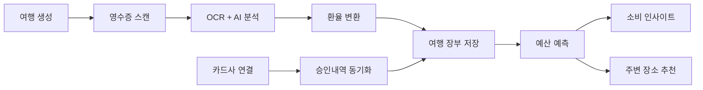
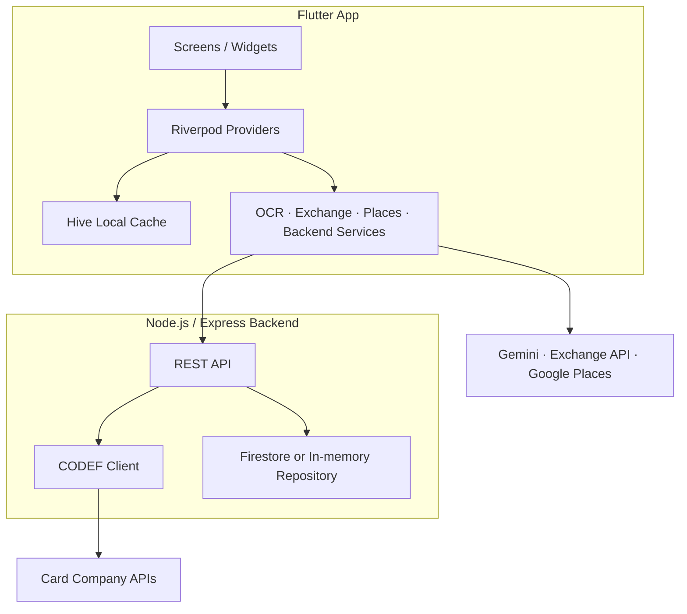

# 멈칫 (TripReceipt)

> 여행 중 영수증을 찍고, 카드 결제를 불러오고, 예산 흐름까지 한 번에 정리하는 여행 경비 메이트

<p align="center">
  
  
  
  
  
</p>

<p align="center">
  <b>Receipt OCR</b> · <b>Real-time Exchange Rate</b> · <b>Card Sync</b> · <b>Budget Forecast</b> · <b>Place Recommendation</b>
</p>

---

## 한눈에 보기

멈칫은 여행 경비를 나중에 몰아서 정리하지 않도록 도와주는 Flutter 앱입니다. 영수증 사진에서 항목과 금액을 읽고, 해외 통화를 원화로 환산하며, 카드사 승인내역을 동기화해 여행별 지출 장부를 자동으로 채웁니다.

여행 예산을 기준으로 현재 소비 속도를 계산하고, 주변 장소 추천까지 이어져서 "지금 써도 괜찮을까?"를 빠르게 판단할 수 있습니다.

## 핵심 기능

| 기능 | 설명 |
| --- | --- |
| 영수증 OCR | 카메라/갤러리로 촬영한 영수증에서 항목, 합계, 통화 힌트를 추출합니다. |
| AI 영수증 분석 | OCR 텍스트와 위치 정보를 바탕으로 Gemini가 지출 항목을 정리합니다. |
| 실시간 환율 변환 | 여행지 통화를 KRW 기준으로 환산해 예산 흐름을 한눈에 보여줍니다. |
| 카드 동기화 | CODEF 연동 백엔드를 통해 카드사 연결과 승인내역 동기화를 처리합니다. |
| 여행별 장부 | 여러 여행을 만들고, 여행별 예산/지출/카테고리를 분리 관리합니다. |
| 예산 예측 | 현재 소비 속도로 예산이 언제 소진될지 계산하고 알림 메시지를 제공합니다. |
| 장소 추천 | Google Places 기반으로 위치, 예산, 소비 습관을 반영한 추천을 제공합니다. |

## 앱 흐름



## 아키텍처



카드사 인증 정보와 CODEF 비밀키는 Flutter 앱에 직접 넣지 않습니다. 백엔드가 OAuth 토큰 발급, 비밀번호 RSA 암호화, 승인내역 정규화, 저장소 접근을 담당합니다.

## 폴더 구조

```text
.
├── lib/
│   ├── config/          # 테마, 앱 색상, 환경 설정
│   ├── models/          # 여행, 영수증, 카드, 추천 모델
│   ├── providers/       # Riverpod 상태 관리
│   ├── screens/         # 앱 화면
│   ├── services/        # OCR, AI, 환율, 카드, 추천 서비스
│   ├── utils/           # 표시/계산 유틸
│   └── widgets/         # 공용 UI 컴포넌트
├── backend/
│   ├── src/             # Express API, CODEF 모듈, 저장소
│   ├── Dockerfile       # Cloud Run 배포용 이미지
│   └── README.md        # 백엔드 상세 문서
├── assets/design/       # 앱 디자인 에셋
├── test/                # Flutter 단위/위젯 테스트
└── README.md
```

## 시작하기

### 1. Flutter 앱 실행

```bash
flutter pub get
flutter run
```

로컬 백엔드에 연결하려면 `BACKEND_BASE_URL`을 `--dart-define`으로 넘깁니다.

```bash
flutter run --dart-define=BACKEND_BASE_URL=http://127.0.0.1:4000
```

| 실행 환경 | 백엔드 URL 예시 |
| --- | --- |
| iOS 시뮬레이터 | `http://127.0.0.1:4000` |
| Android 에뮬레이터 | `http://10.0.2.2:4000` |
| 실제 기기 | `http://<맥-IP>:4000` |
| Cloud Run | `https://<cloud-run-url>` |

API 키를 직접 주입해야 할 때는 아래처럼 함께 전달할 수 있습니다.

```bash
flutter run \
  --dart-define=BACKEND_BASE_URL=http://127.0.0.1:4000 \
  --dart-define=GEMINI_API_KEY=<your-gemini-api-key> \
  --dart-define=EXCHANGE_API_KEY=<your-exchange-api-key> \
  --dart-define=GOOGLE_PLACES_API_KEY=<your-google-places-api-key>
```

로컬 개발 편의를 위해 `lib/config/env_local.dart.example`을 참고해 `lib/config/env_local.dart`를 만들 수도 있습니다.

### 2. 백엔드 실행

```bash
cd backend
cp .env.example .env
npm install
npm run dev
```

기본 포트는 `4000`입니다. `backend/.env`에는 CODEF 데모 화면에서 받은 값을 채웁니다.

```env
CODEF_CLIENT_ID=...
CODEF_CLIENT_SECRET=...
CODEF_PUBLIC_KEY=...
APP_ENCRYPTION_SECRET=...
GOOGLE_PLACES_API_KEY=...
```

백엔드 엔드포인트, Cloud Run 배포, 보안 메모는 [backend/README.md](backend/README.md)에서 더 자세히 볼 수 있습니다.

## 자주 쓰는 명령어

| 작업 | 명령어 |
| --- | --- |
| Flutter 의존성 설치 | `flutter pub get` |
| 앱 실행 | `flutter run` |
| 앱 테스트 | `flutter test` |
| 백엔드 개발 서버 | `cd backend && npm run dev` |
| 백엔드 타입 체크 | `cd backend && npm run check` |
| 백엔드 빌드 | `cd backend && npm run build` |
| 백엔드 실행 | `cd backend && npm start` |

## 백엔드 API 요약

| Method | Path | 설명 |
| --- | --- | --- |
| `GET` | `/health` | 서버 상태 확인 |
| `GET` | `/api/v1/card/connections` | 카드사 연결 목록 |
| `POST` | `/api/v1/card/connections` | 카드사 계정 연결 |
| `DELETE` | `/api/v1/card/connections/:connectionId` | 카드사 연결 삭제 |
| `GET` | `/api/v1/card/connections/:connectionId/cards` | 연결된 카드 목록 |
| `POST` | `/api/v1/card/connections/:connectionId/sync` | 승인내역 동기화 |
| `GET` | `/api/v1/transactions` | 저장된 거래내역 조회 |

개발 단계 인증은 `x-user-id` 헤더를 사용합니다.

```bash
curl -H "x-user-id: demo-user" http://localhost:4000/api/v1/card/connections
```

## 배포 메모

백엔드는 Cloud Run의 `PORT` 환경변수를 사용하도록 구성되어 있습니다.

```bash
gcloud run deploy tripreceipt-backend \
  --source backend \
  --region asia-northeast3 \
  --allow-unauthenticated \
  --min-instances 1 \
  --env-vars-file backend/cloudrun-env.yaml
```

배포 후 헬스체크로 상태를 확인합니다.

```bash
curl https://<cloud-run-url>/health
```

응답이 `{ "ok": true }`이면 정상입니다.

## 기술 스택

| 영역 | 사용 기술 |
| --- | --- |
| App | Flutter, Dart, Riverpod, Hive |
| AI/OCR | Gemini, OCR pipeline |
| Map/Places | Google Maps Flutter, Google Places |
| Network | Dio |
| Backend | Node.js, Express, TypeScript, Zod |
| Data | Firestore, in-memory repository for local dev |
| External | CODEF, Exchange API |
| Deploy | Firebase Hosting, Cloud Run |

## 참고 링크

- [CODEF 공식 문서](https://developer.codef.io/)
- [CODEF Node 레퍼런스](https://github.com/codef-io/codef-node)
- [Flutter 공식 문서](https://docs.flutter.dev/)
- [백엔드 상세 가이드](backend/README.md)
